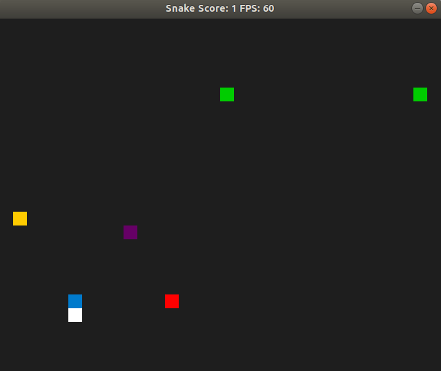

# CPPND: Capstone Snake Game 

This is a Snake Game extended with special events for the Capstone project in the [Udacity C++ Nanodegree Program](https://www.udacity.com/course/c-plus-plus-nanodegree--nd213). 
The code for this repo was inspired by [this](https://codereview.stackexchange.com/questions/212296/snake-game-in-c-with-sdl) excellent StackOverflow post and set of responses.


The events are special fields that the snake can eat and change the behaviour of the game. The events will appear when you get required number of the score. They will disappear when the snake will eat them or the new event will appear. In one time there can even be more than one event on the map.

Events that may occur:
```
green   - the speed of the snake is changed
red     - get extra 10 score
purple  - keyboard control is reversed
```


## Dependencies for Running Locally
* cmake >= 3.7
  * All OSes: [click here for installation instructions](https://cmake.org/install/)
* make >= 4.1 (Linux, Mac), 3.81 (Windows)
  * Linux: make is installed by default on most Linux distros
  * Mac: [install Xcode command line tools to get make](https://developer.apple.com/xcode/features/)
  * Windows: [Click here for installation instructions](http://gnuwin32.sourceforge.net/packages/make.htm)
* SDL2 >= 2.0
  * All installation instructions can be found [here](https://wiki.libsdl.org/Installation)
  * Note that for Linux, an `apt` or `apt-get` installation is preferred to building from source.
* gcc/g++ >= 5.4
  * Linux: gcc / g++ is installed by default on most Linux distros
  * Mac: same deal as make - [install Xcode command line tools](https://developer.apple.com/xcode/features/)
  * Windows: recommend using [MinGW](http://www.mingw.org/)

## Basic Build Instructions

1. Clone this repo.
2. Make a build directory in the top level directory: `mkdir build && cd build`
3. Compile: `cmake .. && make`
4. Copy `example_config.cfg` from the `resources` directory to the `build` directory withe the game executable file.
5. Run it: `./SnakeGame`.

### Additionally

You can build your own scenario with the events. Write your own configuration file and run your game with the instruction `./SnakeGame path_to_event_scenario_file`.

In the scenario file write the name of the event and the number of the score when the event should appear.

Example:
```
speed_up 1
speed_down 3
extra_score 3
reverse_keyboard 1
reverse_keyboard 2
```

Possible events:
speed_up          - add extra speed to the snake 
speed_down        - the snake is slower
extra_score       - get extra 10 score
reverse_keyboard  - change the keyboard control (up key replace with down key, and left key replace with right key)

# For the reviewer

## Code overview

### main.cpp

```
In line 134-145 there is checked command line argument with the config file name.

150: The score is en external object - not a variable inside the game class.
151: Snake is created in main function - not inside the game class.

152: The config file is loaded ->
    120: get_events function ->
        125: the config file content is loaded first, then the list of parameters is passed to the
        126: create_events function. The events are created and added to the events list.
    The event list is returned.
163: The game constructor is called with reference to snake and score objects.
164: The run method is called with moved events list.
```

### config_file_parser.cpp/hpp

```
The class to load the config file content. The class is designed with RAII concept.

(.hpp: 56, cpp. 5-24)
The parameters are stored as pairs of string variables and string values and returned as vector of pairs.
```

### event_list.hpp

```
This class provides is a container to store the events.

30: A move constructor is provided.
34: An assignment move operator is provided.

A copy constructor and a copy assignment operator are not provided as they are not useful. In the current concept we do not want to make a copy of the events list.

43: A method to add the event to the list.
45, 64-84: A method to get the events that shloud appear when the required score is obtained. The events are returned as std::list. If no events meet the condition, the empty list is returned.

53: The class stores events in std::list container.
```

### event.cpp/hpp

```
33: A BaseEvent class provides (42:) a virtual operator() method.

Each event class (63, 76, 90) override the operator() method where the action for the event is performed.
```

### score.h

```
A simple class to manage one integer variable.
```

### controller.cpp/h

```
.h 19: An additional field has been added. 
.h 10-11: Also methods to manipulate the added field.

.cpp 12-73: The HandleInput method has been modified to reverse the keyboard when the added boolean variable is positive.
```

### game.cpp/h

```
In the game loop (.cpp 28-32) the list of the events that should appear is taken from the event list.

In the update method (.cpp 93-96) the current field with the snake is checked if the event should occur.  In the next step the location to draw the events is selected.

.cpp 102 The CheckEvents method iterates over events and checks if the action should be performed.

.cpp 123 The PlaceEvents method selects place on the map to draw the event.

.cpp 152 The FoodCell method to check if there is no collision withe the food on the map during drawing the events.

.cpp 162 The EventCell method to check if there is no collision withe the other event one the map during drawing the events.

.cpp 69 In the PlaceFood method, the collision verification with the events has been added.
```

### renderer.cpp/h

```
In the render method (.cpp 58) the RenderEvents method is called.

.cpp 87-105 The RenderEvents method iterates over visible events and render them on the map.
```

## The rubric overview

### Loops, Functions, I/O

The project demonstrates an understanding of C++ functions and control structures.
A variety of control structures are used in the project.
The project code is clearly organized into functions.
```
For the example please check the design of the event_list.cpp or the event.cpp/hpp files.
```

The project reads data from a file and process the data, or the program writes data to a file.
The project reads data from an external file or writes data to a file as part of the necessary operation of the program.
```
The program loads a file (if provided by the user) with the events.
The class responsible for the file content loading are the config_file_parser.cpp/hpp.

The class object is called from the main.cpp file lines 26-27. Then the content is used in method create_events in main.cpp file (47-118).
```

The project accepts user input and processes the input.
The project accepts input from a user as part of the necessary operation of the program.
```
User can provide the path to the config event file in the command line. These optional parameter is parsed in main.cpp (136-145) file.

The controller.cpp/h class provides a possibility to control the snake by the keyboard. This class was provided in the start repo.
The class has been extended with the possibility to reverse the keyboard. 
```

### Object Oriented Programming

The project uses Object Oriented Programming techniques.
The project code is organized into classes with class attributes to hold the data, and class methods to perform tasks.

Classes use appropriate access specifiers for class members.
All class data members are explicitly specified as public, protected, or private.

Class constructors utilize member initialization lists.
All class members that are set to argument values are initialized through member initialization lists.

Classes encapsulate behavior. Appropriate data and functions are grouped into classes. Member data that is subject to an invariant is hidden from the user. State is accessed via member functions.

```
For the example please check the config_file_parser.hpp/cpp, event_list.hpp, event.cpp/hpp classes.
```
Classes follow an appropriate inheritance hierarchy. Inheritance hierarchies are logical. Composition is used instead of inheritance when appropriate. Abstract classes are composed of pure virtual functions. Override functions are specified.

Overloaded functions allow the same function to operate on different parameters. One function is overloaded with different signatures for the same function name.

Derived class functions override virtual base class functions. One member function in an inherited class overrides a virtual base class member function.

```
Please check the event.hpp/cpp files. All the events override operator() method from the base class. This method is called in the game.cpp line 112.
Inheritance also gives possibility to keep the events in the event_list. This list is created in the main.cpp file -> create_events function (47).
```

Templates generalize functions in the project. One function is declared with a template that allows it to accept a generic parameter.
```
Please check the event_list.hpp/cpp files. 
```

### Memory Management
The project makes use of references in function declarations.
At least two variables are defined as references, or two functions use pass-by-reference in the project code.
```
For the example please check the event.hpp lines: 73 and 87.
```

The project uses destructors appropriately.
At least one class that uses unmanaged dynamically allocated memory, along with any class that otherwise needs to modify state upon the termination of an object, uses a destructor.

The project uses scope / Resource Acquisition Is Initialization (RAII) where appropriate.
The project follows the Resource Acquisition Is Initialization pattern where appropriate, by allocating objects at compile-time, initializing objects when they are declared, and utilizing scope to ensure their automatic destruction.

``` 
Please check the destructor in the config_file_parser.hpp (50-54)
```


The project uses move semantics to move data, instead of copying it, where possible.
For classes with move constructors, the project returns objects of that class by value, and relies on the move constructor, instead of copying the object.

The project uses smart pointers instead of raw pointers.
The project uses at least one smart pointer: unique_ptr, shared_ptr, or weak_ptr. The project does not use raw pointers.

```
Please check the method create_events in the main.cpp file.
Events are created with unique_ptrs and moved to the event list (70-90).
```